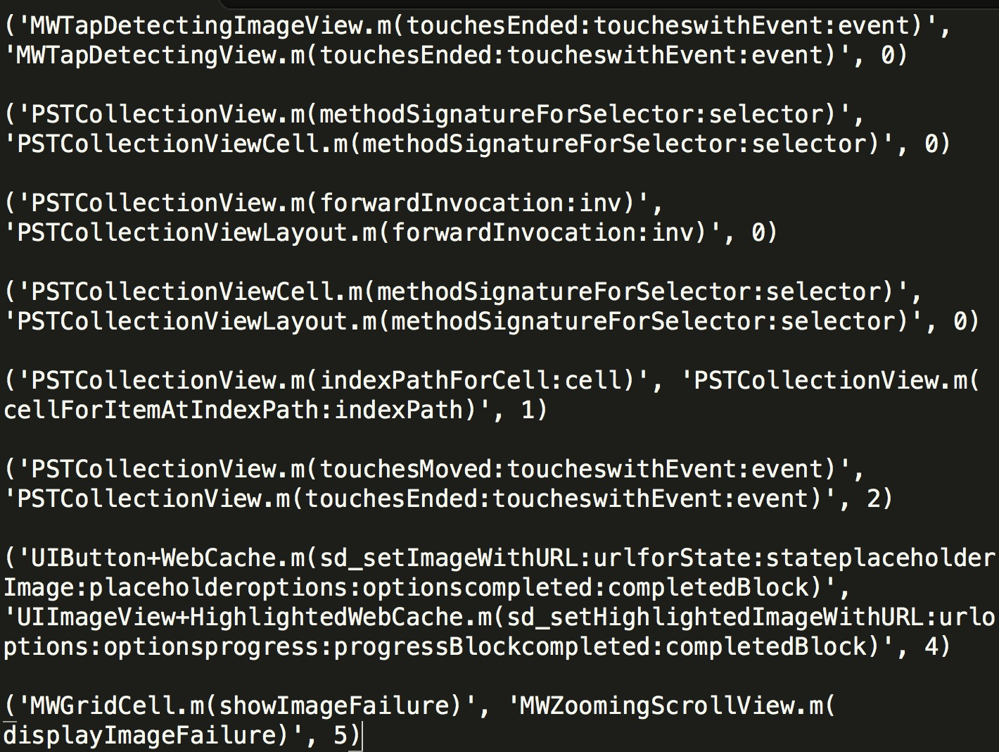

# SameCodeFinder

SameCodeFinder is a static code text scanner which can find the similar or the same code file in a big directory.

## Feature

SameCodeFinder could detect the same function in the source code files. The finder could show the `Hamming Distacnce` between two funcitons.

* Find the same code which need to be extract to reuse
* Show the Hamming Distance between each soucecode file(Support All kinds of soucecode type)
* Show the Hamming Distance between each soucecode function(Support Java and Object-C now) 

The below photo show the calculate result of [MWPhotoBrowser](https://github.com/mwaterfall/MWPhotoBrowser)


The result come from the command
```
python SameCodeFinder.py ~/Projects/opensource/MWPhotoBrowser/ .m  --max-distance=10 --min-linecount=3 --functions --detail
```

## Usage

Install the python implement of [SimHash](https://github.com/leonsunliang/simhash)

``` Ruby
pip install simhash
```

Visit [A Python Implementation of Simhash Algorithm](http://leons.im/posts/a-python-implementation-of-simhash-algorithm/) if you want to know more about the module.

``` Ruby
python SameCodeFinder.py [arg0] [arg1] 
```

#### Optional
* ```[arg0]```
	* Target Directory of files should be scan
* ```[arg1]```
	* Doc Suffix of files should be scan, eg
		* .m     - Object-C file 
		* .swift - Swift file
		* .java  - Java file
* ```--detail```         
	* show process detail of scan
* ```--functions```          
	* Use Functions as code scan standard
* ```--max-distance=[input]``` 
	* max hamming distance to keep, default is 20
* ```--min-linecount=[input]```
	* for function scan, the function would be ignore if the total line count of the function less than min-linecount
* ```--output=[intput]```
    * Customize the output file, default is "out.txt"
	

## Requirement

Python 2.6+, Pip 9.0+, [simhash](https://github.com/leonsunliang/simhash)

## License

SameCodeFinder is available under the MIT license. See the LICENSE file for more info.